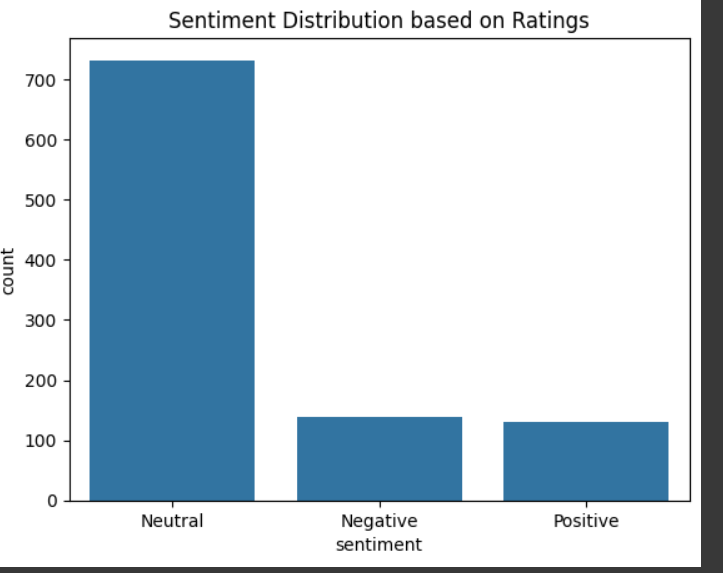

# FUTURE_DS_03
College Event Feedback Analysis – Future Interns Data Science &amp; Analytics Internship 
Goal: Analyze student event feedback to uncover satisfaction trends and provide actionable insights.  

---

## 📊 Project Overview
College events like workshops, seminars, and cultural fests collect valuable feedback.  
In this project, survey data was analyzed using **Data Science techniques** to understand student satisfaction.  

---

## ✅ Steps Performed
- Data cleaning & preparation (Google Form export → CSV → pandas)
- Sentiment Analysis using **TextBlob**
- Rating trend analysis (1–5 scale)
- Visualization with **seaborn/matplotlib**
- Word Cloud from comments
- Actionable recommendations for organizers

---

## 🧠 Skills Gained
- Data Cleaning with pandas  
- Sentiment Analysis (NLP)  
- Visualization & Dashboarding  
- Interpreting survey insights  

---

## 🛠 Tools Used
- Google Colab  
- pandas  
- seaborn / matplotlib  
- TextBlob (NLP)  

---

## 📸 Sample Visualizations
  
  
 
---

##  Author
**Yash Sharma**  
🔗 [LinkedIn](https://www.linkedin.com/in/yash-sharma-8a04b82b8)  
🔗 [GitHub](https://github.com/hsaysh)  

---
 *If you found this project interesting, don't forget to star this repo!*
